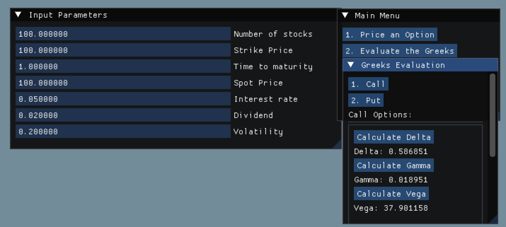

# Black-Scholes-using-Dear-ImGui

#### You could download DearImGui here: https://github.com/ocornut/imgui
#### Include these files in the same project directory

### Note:
#### This project is only intended to show DearImGui features but not Object Oriented Programming and other advanced C++ techniques.

#### Output is this:

